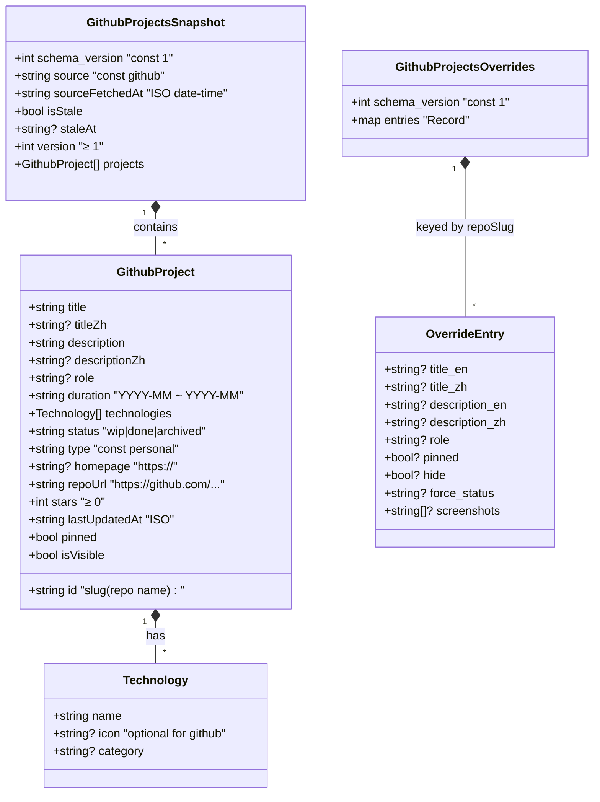

# 🗄 GitHub Portfolio Sync — Schema SSOT v1.0

> 產出角色：02b DBA / API Architect
> 日期：2026-04-19
> 類型：**NoSQL 文件型**（JSON 靜態檔，非關聯式 DB）
> 上游：`github_portfolio_sync_BA_v1.md`

---

## 1. 資料檔案清單（Aggregate Roots）

| 檔案 | 角色 | 更新者 | Schema 檔 |
| --- | --- | --- | --- |
| `assets/data/github-projects.json` | **Snapshot Aggregate**：GitHub 同步後的權威資料 | GitHub Actions bot | `schemas/github-projects.schema.json` |
| `assets/data/github-projects.overrides.json` | **Override Aggregate**：手動覆寫層 | 開發者人工 | `schemas/github-projects-overrides.schema.json` |

### Bounded Context
- `GithubPortfolioContext`：兩個 Aggregate 組成
- 與 `ManualPortfolioContext`（`portfolio-projects.json`）無直接引用，合併邏輯由上層 composable 處理

---

## 2. Schema 結構（Mermaid ClassDiagram）

> 📊 將上方 Mermaid 貼入 https://mermaid.live 即可產生互動式結構圖

---

## 3. 欄位詳細定義

### 3.1 `GithubProjectsSnapshot`（root of `github-projects.json`）

| Field | Type | Required | 說明 |
| --- | --- | --- | --- |
| `schema_version` | integer const 1 | ✓ | 遷移用 |
| `source` | string const `"github"` | ✓ | 區分於 manual/leetcode |
| `sourceFetchedAt` | ISO date-time | ✓ | 最後成功 API call 時間 |
| `isStale` | boolean | ✓ | 是否為 stale cache |
| `staleAt` | ISO date-time \| null | optional | 轉為 stale 的時點；isStale=false 時為 null |
| `version` | integer ≥ 1 | ✓ | snapshot 版本號，每次寫入 +1 |
| `projects` | GithubProject[] | ✓ | 過濾後的 repo 清單（含 hidden = false） |

### 3.2 `GithubProject`

| Field | Type | Required | 說明 |
| --- | --- | --- | --- |
| `id` | string slug `^[a-z0-9][a-z0-9._-]{0,99}$` | ✓ | 對應 repo name（如 `lionel_exchange`）|
| `title` | string | ✓ | override `title_en` 或 repo name |
| `titleZh` | string \| null | optional | override 中文標題 |
| `description` | string | ✓ | override `description_en` 或 repo description（可為空字串）|
| `descriptionZh` | string \| null | optional | override 中文敘述 |
| `role` | string \| null | optional | override 填寫；無則為 null |
| `duration` | string | ✓ | 格式 `"YYYY.MM ~ YYYY.MM"` 或 `"YYYY.MM ~ Now"` |
| `technologies` | Technology[] | ✓ | 從 GitHub languages 衍生 |
| `status` | enum `wip\|done\|archived` | ✓ | 推斷或明示 |
| `type` | const `"personal"` | ✓ | 本類資料強制此值 |
| `homepage` | string https:// \| null | optional | repo.homepageUrl |
| `repoUrl` | string https:// | ✓ | `https://github.com/{user}/{repo}` |
| `stars` | integer ≥ 0 | ✓ | GitHub stargazerCount |
| `lastUpdatedAt` | ISO date-time | ✓ | repo.pushedAt |
| `pinned` | boolean | ✓ | override.pinned ?? false |
| `isVisible` | boolean | ✓ | `hasPortfolioTopic && !override.hide` |

### 3.3 `Technology`

| Field | Type | Required | 說明 |
| --- | --- | --- | --- |
| `name` | string (≥1) | ✓ | 語言名稱（如 `TypeScript`）|
| `icon` | string \| null | optional | 可選；github source 通常 null |
| `category` | string \| null | optional | 目前固定 `"程式語言"` 或 null |

### 3.4 `GithubProjectsOverrides`（root of `github-projects.overrides.json`）

| Field | Type | Required | 說明 |
| --- | --- | --- | --- |
| `schema_version` | integer const 1 | ✓ | |
| `entries` | Record<string, OverrideEntry> | ✓ | key 為 repo slug；可為空物件 `{}` |

### 3.5 `OverrideEntry`

| Field | Type | Required | 說明 |
| --- | --- | --- | --- |
| `title_en` | string | optional | 覆寫標題（英）|
| `title_zh` | string | optional | 覆寫標題（中）|
| `description_en` | string | optional | 覆寫描述（英）|
| `description_zh` | string | optional | 覆寫描述（中）|
| `role` | string | optional | 擔任角色（自由填寫）|
| `pinned` | boolean | optional | 預設 false |
| `hide` | boolean | optional | 預設 false；true 則不納入 |
| `force_status` | enum `wip\|done\|archived` | optional | 強制蓋掉推斷值 |
| `screenshots` | array of `{url, caption?}` | optional | 詳情頁截圖 |

---

## 4. 索引策略（僅記憶體內計算）

本資料為靜態 JSON，無 DB index 概念。但 composable 於載入時建立以下 in-memory map：

- `Map<id, GithubProject>`：O(1) `findProjectById`
- `pinned projects` sorted list
- `by-status Map`：用於未來可能的篩選 UI

---

## 5. 併發 / 衝突處理

| 場景 | 處理 |
| --- | --- |
| Script 執行中 repo 被使用者改 topic | 下次 cron 以最新為準；本次以 query 當下為準 |
| 人工手改 `github-projects.json` | ⚠️ **強烈不建議**。下次 cron 會覆寫；應改 overrides 檔 |
| 人工改 overrides 檔 + cron 同時執行 | 檔案系統原子寫入保護（`fs.writeFileSync` 單步）|
| 多個 workflow 併發 | `concurrency: sync-github` 群組鎖 |

**沒有樂觀鎖 `version` 欄位於 GithubProject 層級**（不支援多寫入者）；snapshot 層的 `version` 僅為遞增記錄。

---

## 6. 資料演進（Schema Migration）

- `schema_version: 1` 為目前唯一版本
- 若未來新增欄位（如 `readmeExcerpt`、`deployStatus`）：
  - **非破壞性增加** → 欄位為 optional，無需升版
  - **破壞性改 key** → 升至 `schema_version: 2`，同時更新 validate-ssot 與 composable

---

## 7. 驗證規則（給 `scripts/validate-json-ssot.mjs`）

於 snapshot 檔：
- [ ] `schema_version === 1`
- [ ] `source === 'github'`
- [ ] `sourceFetchedAt` 為 ISO date-time
- [ ] 所有 `projects[].id` 符合 slug pattern 且無重複
- [ ] 所有 `projects[].status` 屬於 enum
- [ ] 所有 `projects[].repoUrl` 以 `https://github.com/` 開頭
- [ ] `projects[].type === 'personal'`

於 overrides 檔：
- [ ] `schema_version === 1`
- [ ] `entries` 為物件（可為 `{}`）
- [ ] 每個 entry value 的 `force_status` 若存在必須是合法 enum

---

## 8. 禁止事項（給 Watcher 稽核點）

1. ❌ 不可在 `github-projects.json` 手動增刪 `projects[]`（應透過 GitHub topic 控制）
2. ❌ 不可直接在 composable 修改 snapshot 物件（read-only mutation）
3. ❌ 不可在 script 中硬編碼 username（一律讀 env `GITHUB_USERNAME`）
4. ❌ overrides 檔不可放任何 secret / token
5. ❌ 同一 `id` 不可同時存在於 manual 與 github snapshot 中被顯示（合併邏輯 dedup 由 composable 負責）

---

## 9. 交付確認

- [x] Schema 結構（Mermaid）
- [x] 欄位定義與 enum
- [x] 遷移策略
- [x] 驗證規則清單
- [x] Watcher 稽核點

下一步：依此產出 `schemas/github-projects.schema.json` + `schemas/github-projects-overrides.schema.json` JSON Schema 檔案。
