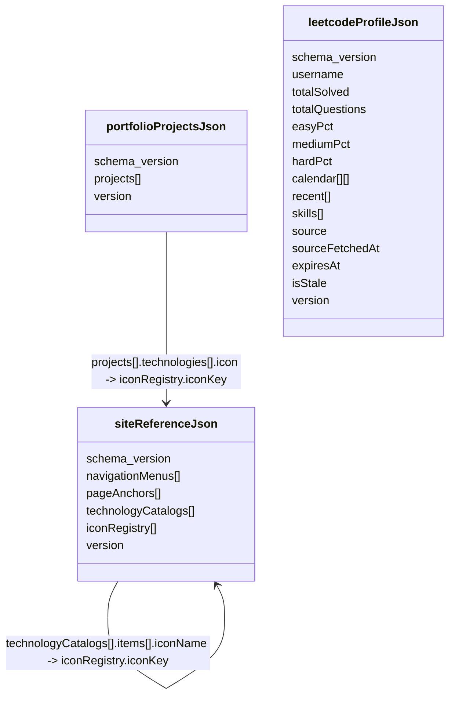

# JSON File SSOT Schema v1

## 1. 選型
- 本階段正式選用 JSON File SSOT。
- 靜態 JSON 由維護者人工編輯。
- 動態 JSON 由排程腳本產生。
- Machine-readable schema 位於 `/schemas/*.schema.json`。

## 2. SSOT 檔案圖


## 3. 檔案定義

### 3.1 `assets/data/site-reference.json`
```ts
type SiteReferenceJson = {
  schema_version: number
  generatedAt: string
  navigationMenus: NavigationMenu[]
  pageAnchors: PageAnchor[]
  technologyCatalogs: TechnologyCatalog[]
  iconRegistry: IconRegistryItem[]
  version: number
}
```

### 3.2 `assets/data/portfolio-projects.json`
```ts
type PortfolioProjectsJson = {
  schema_version: number
  generatedAt: string
  projects: PortfolioProject[]
  version: number
}
```

### 3.3 `assets/data/leetcode-profile.json`
```ts
type LeetCodeProfileJson = {
  schema_version: number
  id: string
  username: string
  totalSolved: number
  totalQuestions: number
  easy: number
  medium: number
  hard: number
  easyPct: number
  mediumPct: number
  hardPct: number
  calendar: [string, number][]
  recent: LeetCodeRecent[]
  skills: LeetCodeSkill[]
  source: 'mock' | 'provider' | 'manual' | 'stale-cache'
  sourceFetchedAt: string
  expiresAt: string
  isStale: boolean
  version: number
}
```

## 4. 遷移規則
- 任何破壞性欄位更名，必須新增 schema v2，不得覆寫 v1。
- 前端 TypeScript types 必須從本 schema 對應，禁止自行重定義衝突欄位。
- `portfolio.projects.<id>` i18n key 契約必須保留，除非建立 v2 並同步遷移 i18n。

## 5. 驗證責任
- SA Agent 02：維護 schema 與契約。
- Backend Agent 05：同步產生的 JSON 必須符合 schema。
- Frontend Agent 04：讀取 JSON 時不得假設 schema 外欄位。
- Watcher Agent 90：比對 JSON、schema、TypeScript types 與前端使用欄位。
