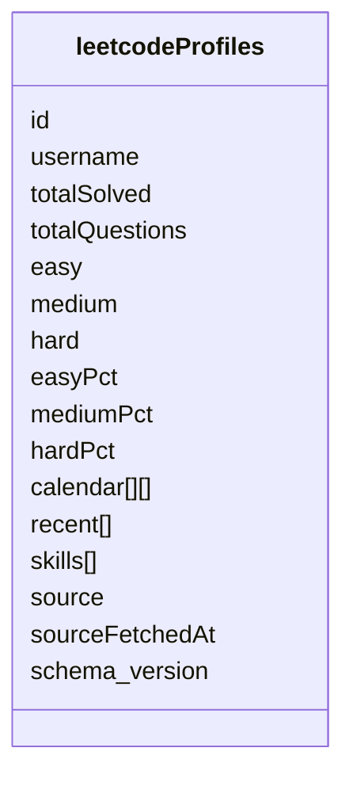

# LeetCode Profile Schema v1

## 1. 選型
- 文件型資料庫：MongoDB-like
- 理由：前端保留項是 normalized read model，適合單筆文件聚合
- 遷移策略：保留 `schema_version`

## 2. Collection 關係圖


## 3. Collection 定義

### 3.1 `leetcodeProfiles`
```ts
type LeetCodeRecentDocument = {
  title: string
  titleSlug: string
  time: string
  status: string
  lang: string
  isSuccess: boolean
}

type LeetCodeSkillDocument = {
  name: string
  value: number
}

type LeetCodeProfileDocument = {
  id: string
  username: string
  totalSolved: number
  totalQuestions: number
  easy: number
  medium: number
  hard: number
  easyPct: number
  mediumPct: number
  hardPct: number
  calendar: [string, number][]
  recent: LeetCodeRecentDocument[]
  skills: LeetCodeSkillDocument[]
  source: string
  sourceFetchedAt: string
  schema_version: number
  createdAt: string
  updatedAt: string
  deletedAt: string | null
  version: number
}
```

## 4. 欄位規範
- `id`
  - 文件主鍵
  - 建議值：`leetcode:{username}`
- `username`
  - 外部查詢主體
  - 同時作為 unique business key
- `calendar`
  - 保留現有 tuple 契約
  - `[date, count]` 其中 `date` 格式固定 `YYYY-MM-DD`
- `recent`
  - 僅保留前端直接渲染需要的欄位
  - 不保留 provider 原始 timestamp
- `skills`
  - 取已正規化後的技能清單
- `source`
  - 資料來源，例如 `mock`, `provider`, `manual`
- `sourceFetchedAt`
  - 最後成功同步時間

## 5. Embedded / Reference 規範
- `calendar`：Embedded
- `recent`：Embedded
- `skills`：Embedded
- v1 不拆子 collection，優先保留前端讀模型完整性

## 6. 索引建議
- `id`：unique
- `username`：unique
- `sourceFetchedAt`
