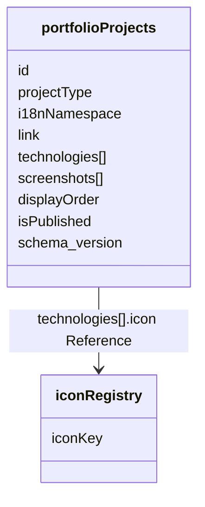

# Portfolio Showcase Schema v1

## 1. 選型
- 文件型資料庫：MongoDB-like
- 理由：作品 metadata 以單筆文件聚合即可完成列表與詳情讀取，且需保留既有 camelCase 欄位
- 遷移策略：保留 `schema_version`

## 2. Collection 關係圖


## 3. Collection 定義

### 3.1 `portfolioProjects`
```ts
type PortfolioTechnologyDocument = {
  name: string
  icon: string
  category?: string | null
}

type PortfolioScreenshotDocument = {
  url: string
  caption?: string | null
}

type PortfolioProjectDocument = {
  id: string
  projectType: 'company' | 'personal'
  i18nNamespace: string
  link: string | null
  technologies: PortfolioTechnologyDocument[]
  screenshots: PortfolioScreenshotDocument[]
  displayOrder: number
  isPublished: boolean
  schema_version: number
  createdAt: string
  updatedAt: string
  deletedAt: string | null
  version: number
}
```

## 4. 欄位規範
- `id`
  - 穩定主鍵
  - 兼作前端 detail lookup key
  - 範例：`systalk-adminhub`, `travel-planner`
- `projectType`
  - 正式分類欄位
  - 禁止再以 `id` 字串推導
- `i18nNamespace`
  - v1 固定使用 `portfolio.projects`
  - 作為多語文案命名空間
- `technologies`
  - Embedded
  - `icon` 為 reference token，指向 icon registry
- `screenshots`
  - Embedded
  - 供卡片與詳情頁共用
- `displayOrder`
  - 決定列表排序
- `isPublished`
  - 控制前台是否可見

## 5. Embedded / Reference 規範
- `technologies`：Embedded
- `screenshots`：Embedded
- `technologies[].icon -> site_reference_data.iconRegistry.iconKey`：Reference

## 6. 索引建議
- `id`：unique
- `projectType + displayOrder`
- `isPublished + displayOrder`
- `i18nNamespace + id`
