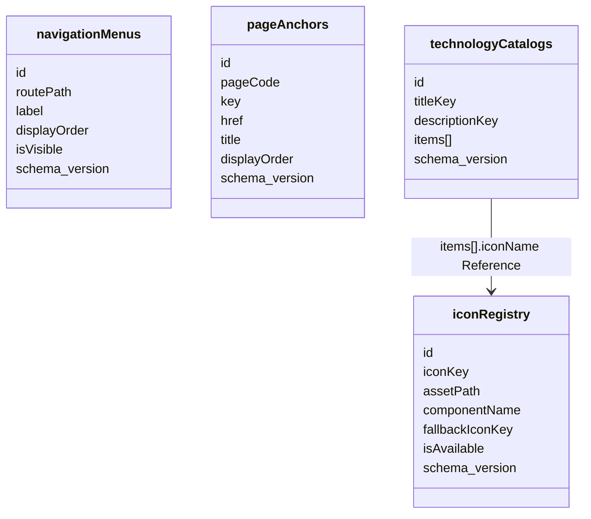

# Site Reference Data Schema v1

## 1. 選型
- 文件型資料庫：MongoDB-like
- 理由：導航、anchors、技術分類、icon registry 皆屬內容型文件，且需保留既有 camelCase 欄位
- 遷移策略：所有 collection 皆保留 `schema_version`

## 2. Collection 關係圖


## 3. Collection 定義

### 3.1 `navigationMenus`
```ts
type NavigationMenuDocument = {
  id: string
  routePath: string
  label: string
  displayOrder: number
  isVisible: boolean
  schema_version: number
  createdAt: string
  updatedAt: string
  deletedAt: string | null
  version: number
}
```

- `id`：穩定主鍵，例如 `home`, `about`, `portfolio`
- `routePath`：站內路徑，例如 `/`, `/about`, `/portfolio`
- `label`：目前直接提供顯示文字
- `displayOrder`：導覽排序
- `isVisible`：是否顯示於主導航

### 3.2 `pageAnchors`
```ts
type PageAnchorDocument = {
  id: string
  pageCode: string
  key: string
  href: string
  title: string
  displayOrder: number
  schema_version: number
  createdAt: string
  updatedAt: string
  deletedAt: string | null
  version: number
}
```

- `pageCode`：`home | about | portfolio`
- `key`：前端 anchor 穩定識別，例如 `section1`
- `href`：對應 hash，例如 `#section1`
- `title`：anchor 顯示文字

### 3.3 `technologyCatalogs`
```ts
type TechnologyCatalogItemDocument = {
  name: string
  iconName: string
  color: string | null
}

type TechnologyCatalogDocument = {
  id: string
  titleKey: string
  descriptionKey: string
  items: TechnologyCatalogItemDocument[]
  schema_version: number
  createdAt: string
  updatedAt: string
  deletedAt: string | null
  version: number
}
```

- `titleKey` / `descriptionKey`：保留既有 i18n key 契約
- `items`：採 Embedded，避免技術分類取用時多次 round-trip
- `items[].iconName`：Reference 到 `iconRegistry.iconKey`

### 3.4 `iconRegistry`
```ts
type IconRegistryDocument = {
  id: string
  iconKey: string
  assetPath: string
  componentName: string
  fallbackIconKey: string | null
  isAvailable: boolean
  schema_version: number
  createdAt: string
  updatedAt: string
  deletedAt: string | null
  version: number
}
```

- `iconKey`：前端與資料層共用 token
- `assetPath`：靜態資產路徑
- `componentName`：目前編譯後 component 名稱
- `fallbackIconKey`：找不到對應資產時的遞補 token

## 4. Embedded / Reference 規範
- `technologyCatalogs.items`：Embedded
- `technologyCatalogs.items[].iconName -> iconRegistry.iconKey`：Reference
- `navigationMenus` 與 `pageAnchors` 不互相內嵌，避免頁面資訊架構修改時產生重複更新

## 5. 索引建議
- `navigationMenus.routePath`：unique
- `pageAnchors.pageCode + pageAnchors.displayOrder`
- `technologyCatalogs.id`：unique
- `iconRegistry.iconKey`：unique
