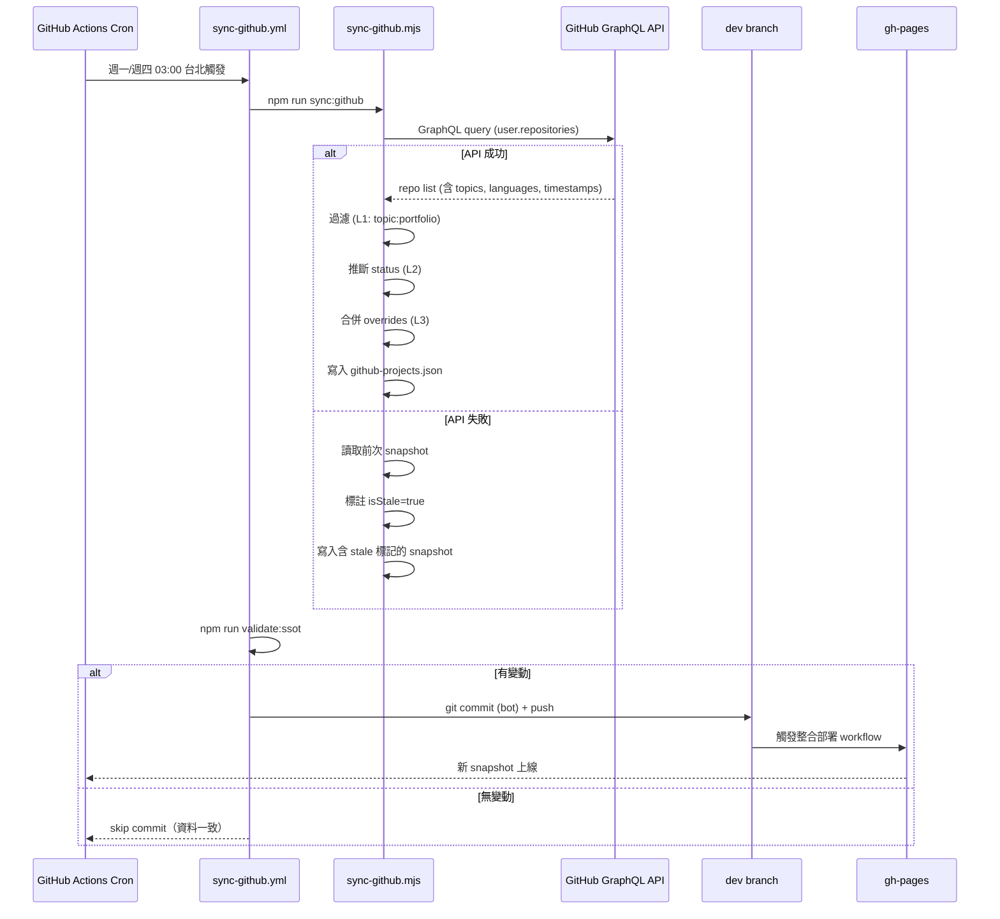
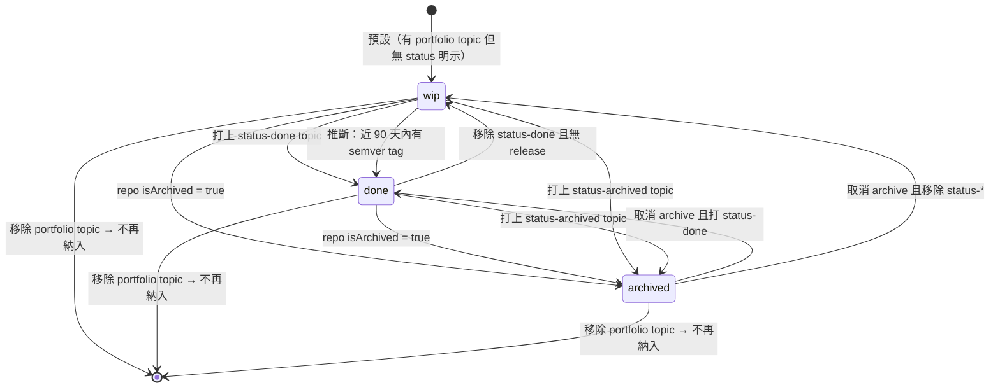

# 📋 GitHub Portfolio Sync — Business Analysis v1.0

> 產出角色：02a BA Agent
> 日期：2026-04-19
> 上游依賴：`github_portfolio_sync_TechPlan_v1.md`
> 狀態：核可

---

## 1. 商業目標

**讓個人作品集能自動展示 GitHub 上標記為 `portfolio` 的公開 repo**，與既有手動維護的前公司專案（昕力、資策會等）共存，降低使用者手動更新 `/portfolio` 的成本。

---

## 2. Bounded Context 切分

| Context | 職責 | 資料來源 |
| --- | --- | --- |
| **Manual Portfolio** | 手動維護的作品集（含 `type: company` 的前公司專案）| `assets/data/portfolio-projects.json` + i18n keys |
| **GitHub Portfolio** | 自動從 GitHub 同步的個人 repo | `assets/data/github-projects.json` + `github-projects.overrides.json` |
| **Unified Portfolio View** | 合併兩資料源於 `/portfolio` 頁面展示 | `composables/usePortfolioProjects.ts`（聚合層）|

### 跨 Context 互動原則
- Manual 與 GitHub 為**平行資料源**，無上下游依賴
- 合併時若 `id` 重複，**Manual 優先**（避免 GitHub 覆蓋手寫內容）
- 狀態流轉僅存在於 GitHub Context；Manual 專案無 `status` 概念

---

## 3. 領域語彙（Ubiquitous Language）

| 詞彙 | 定義 | 禁止混用 |
| --- | --- | --- |
| `ManualProject` | 手動於 `portfolio-projects.json` 維護的專案 | ≠ `GithubProject` |
| `GithubProject` | 從 GitHub API 自動抓取的專案 | ≠ `ManualProject` |
| `status` | 開發狀態（`wip` / `done` / `archived`）| ≠ `isPublished` / `isVisible` |
| `isVisible` | 衍生布林：專案最終是否出現在列表 | 計算規則：`hasPortfolioTopic && !override.hide` |
| `pinned` | 由 override 指定置頂 | 僅 `GithubProject` 有此屬性；`ManualProject` 用 `displayOrder` |
| `portfolio` topic | GitHub repo 標記為「要展示於作品集」的 topic | L1 納入機制核心 |
| `status-*` topic | `status-wip` / `status-done` / `status-archived` 三選一 | L2 狀態判定核心 |

---

## 4. 業務流程：每週同步時序

---

## 5. 狀態機：GithubProject.status

### 推斷優先序（L2 topic 未標示時的 fallback）
1. `repository.isArchived === true` → `archived`
2. 近 90 天內有 semver tag release → `done`
3. 否則 → `wip`

---

## 6. 業務邏輯邊界

### 前置條件（Pre-conditions）
- GitHub `jack755051` 公開可讀
- 目標 repo 必須打上 `portfolio` topic（否則不會被納入）
- workflow 需能寫回 `dev` 分支（`permissions: contents: write`）

### 後置條件（Post-conditions）
- `assets/data/github-projects.json` 內容為最新 snapshot（或上次 stale 保留）
- 合法通過 `validate:ssot`
- 若有變動，`dev` 分支有 bot commit、gh-pages 有對應部署

### 業務規則
1. **Manual 優先**：若 `id` 於 manual projects 已存在，GitHub 同步進來的同名 repo **不顯示**
2. **Personal only**：GitHub 專案強制 `type: personal`；公司專案走 manual 資料源
3. **Stale 容錯**：API 失敗時不清空資料，只加 `isStale` 標記
4. **無 description 不隱藏**：repo description 為空時，fallback 到 repo name；卡片仍顯示
5. **Archived 仍顯示**：`archived` 狀態仍顯示於列表（帶灰色 badge），但於詳情頁提示「已歸檔」

---

## 7. Edge Cases / 異常處理

| 情境 | 處理 |
| --- | --- |
| 使用者忘打 `portfolio` topic | repo 不會出現；workflow log 輸出所有公開 repo 供比對 |
| `portfolio` topic 但同時有多個 `status-*` topic | 優先序：`archived` > `done` > `wip` |
| repo 被改名 | `id` 失配 → 舊資料被新 id 覆蓋；override 需手動改 key |
| override 的 id 對應不到任何 repo | Schema 驗證通過但 runtime 無作用；workflow log 輸出 warning |
| Manual 與 GitHub `id` 相同 | Manual 版本顯示，GitHub 版本靜默跳過 |
| Rate limit 被擋（雖極罕見）| fallback 到 `isStale: true` 模式 |
| 使用者未來刪除 repo | 下次同步自動移除；`ManualProject` 不受影響 |

---

## 8. UI/UX 邊界（給 03 UI）

- **已歸檔專案**：仍顯示卡片但視覺弱化（灰色 badge、降低 card opacity 70%）
- **Stale 狀態**：若 `github-projects.json.isStale === true`，不顯示紅色警告（避免破壞瀏覽體驗），僅於 devtools console 輸出 warning
- **Empty state**：若 GitHub 無符合 repo（含 overrides 都 hide）→ 列表只顯示 manual；不顯示額外區塊標題

---

## 9. 成功指標

- ✅ 使用者新增一個 repo 打上 `portfolio` topic → 下次 cron 後自動出現於網站
- ✅ 使用者 archive 某 repo → badge 變灰
- ✅ 公司專案（昕力等）不受影響
- ✅ API 故障當天，網站仍顯示上次資料

---

## 10. 派發確認給 02b DBA

接下來 02b DBA 需依本規格產出：
1. `docs/architecture/database/github_portfolio_sync_schema_v1.md`（SSOT）
2. `schemas/github-projects.schema.json`
3. `schemas/github-projects-overrides.schema.json`
4. 擴充 `scripts/validate-json-ssot.mjs` 納入驗證

注意：status enum、id pattern、overrides optional properties 均需 strict 定義。
