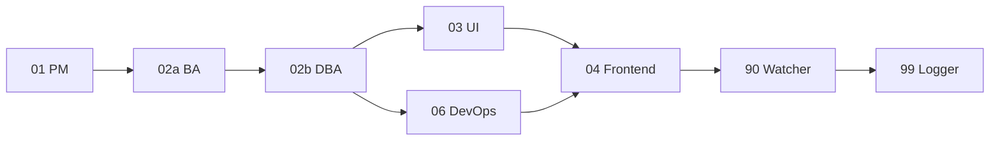

# 🏗 GitHub Portfolio Sync — TechPlan v1.0

> 產出角色：02 Tech Lead
> 日期：2026-04-19
> 狀態：✅ 已取得使用者核可（Q1~Q5 全採推薦方案）
> 觸發脈絡：自動化同步 `jack755051` 的個人 GitHub repo 至 `/portfolio` 頁面，與現有手動 metadata 共存

---

## [需求摘要]

將 `jack755051` 於 GitHub 標記為 `portfolio` topic 的公開 repo 每週自動同步兩次至本專案，轉化為 `portfolio-projects` 列表項目，於 `/portfolio` 以卡片呈現並於 `/portfolio/detail` 提供詳情頁，支援開發狀態（WIP / Done / Archived）與本地語系覆寫；昕力科技等前公司專案沿用現有手動 JSON metadata 不受影響。

---

## [技術選型與風險]

### 1. 資料來源
- **GitHub GraphQL API**（`https://api.github.com/graphql`）
  - 單一請求取齊 `name / description / url / homepageUrl / languages / repositoryTopics / stargazerCount / createdAt / pushedAt / isArchived`
  - 對照 REST 需 N+1 呼叫（languages、topics 分開查）→ 選 GraphQL 效率更高
- **Auth**：不使用 PAT（Q5 決議）；公開 repo API 60 req/hr，每週 2 次執行 → 遠低於配額
- **Query 範例**：
  ```graphql
  query($login: String!) {
    user(login: $login) {
      repositories(first: 100, privacy: PUBLIC, isFork: false,
                   orderBy: {field: PUSHED_AT, direction: DESC}) {
        nodes {
          name
          description
          url
          homepageUrl
          isArchived
          stargazerCount
          createdAt
          pushedAt
          primaryLanguage { name }
          languages(first: 10) { nodes { name } }
          repositoryTopics(first: 10) { nodes { topic { name } } }
        }
      }
    }
  }
  ```

### 2. 排程與觸發
- **Cron**：`0 19 * * 0,3` UTC = 台北時間 **週一 03:00** 與 **週四 03:00**（Q4 決議）
- **workflow_dispatch**：允許手動觸發（debugging / 首次 bootstrap）
- **獨立 workflow file**：`sync-github.yml`，與現有 `sync-leetcode.yml` 互不影響；`concurrency` 群組分離

### 3. 快取與容錯策略（對齊 LeetCode 模式）
- API 失敗 → 保留上次 snapshot，標 `isStale: true + staleAt: ISO`
- 產出時 schema version：`schema_version: 1` 供未來遷移
- Snapshot 檔：`assets/data/github-projects.json`（GitHub Actions 自動 commit 回 dev）

### 4. 三層過濾機制（Q1 決議）

| Layer | 機制 | 作用 |
| --- | --- | --- |
| **L1 Inclusion** | 只納入 `repositoryTopics` 含 `portfolio` 的 repo | 白名單，無需維護檔案 |
| **L2 Status** | 讀取 `status-wip` / `status-done` / `status-archived` topic | 對應 UI status badge |
| **L3 Overrides** | `assets/data/github-projects.overrides.json` 手動覆寫或隱藏特定 repo | 中文化、排序（pinned）、特例處理 |

Status 推斷優先序（L2 缺失時的 fallback）：
1. 若 `isArchived=true` → `archived`
2. 若有 `status-done` topic 或 近 90 天內有 semver tag release → `done`
3. 否則 → `wip`

### 5. 安全性
- **無 secret 曝險**：公開 API、無 PAT
- **Supply chain**：GraphQL endpoint 為 GitHub 官方，可信；HTTPS + TLS
- **本地 overrides 檔**：為 repo 追蹤內容，不可放 token/credential

### 6. 潛在風險與緩解

| 風險 | 可能性 | 影響 | 緩解 |
| --- | --- | --- | --- |
| Rate limit 超標 | 極低 | 排程失敗 | 週 2 次、單請求，消耗 ≤ 1/hr |
| repo 無 description | 中 | 卡片空白 | L3 overrides 補 `description_zh` / `description_en` |
| 中文化缺口 | 高 | i18n 不一致 | overrides schema 支援 `*_zh` / `*_en` 鍵 |
| 忘打 `portfolio` topic | 高 | repo 漏收 | 首次執行輸出 warning log；文件化 SOP |
| GraphQL schema 變動 | 低 | 同步失敗 | schema_version + validate:ssot 攔截 |
| Status 推斷誤差 | 中 | badge 顯示錯誤 | L2 topic 優先 + L3 override 可 force |

### 7. 資料 Schema 草案

#### `assets/data/github-projects.json`
```ts
interface GithubProjectsSnapshot {
  schema_version: 1
  source: 'github'
  sourceFetchedAt: string   // ISO
  isStale: boolean
  staleAt?: string
  projects: GithubProject[]
}

interface GithubProject {
  id: string                   // repo slug（唯一識別，如 "lionel_exchange"）
  title: string                // override.title_en 或 repo name
  title_zh?: string            // override only
  description: string          // override.description_en 或 repo description
  description_zh?: string      // override only
  role?: string                // override only
  duration: string             // auto: createdAt → pushedAt 格式化
  technologies: { name: string }[]  // repo.languages
  status: 'wip' | 'done' | 'archived'
  type: 'personal'             // 本類資料源強制分類
  homepage?: string            // repo.homepageUrl
  repoUrl: string              // repo.url
  stars: number
  lastUpdatedAt: string        // repo.pushedAt
  pinned?: boolean             // override
  isVisible: boolean           // 純衍生：topic portfolio ∧ !override.hide
  source: 'github'
}
```

#### `assets/data/github-projects.overrides.json`（人工維護，可為空）
```json
{
  "lionel_exchange": {
    "title_zh": "Lionel 交易所前端",
    "description_zh": "個人加密資產分析工具，整合多交易所 K 線與套利偵測。",
    "role": "Full-Stack Engineer",
    "pinned": true,
    "hide": false
  },
  "charlie-ai-protocols": {
    "title_zh": "Charlie AI 協作協議",
    "description_zh": "AI 多 Agent 協作規範集，用於大型專案中的結構化分工。",
    "role": "Author & Maintainer",
    "pinned": true
  },
  "financial-agent-frontend": {
    "title_zh": "金融 AI Agent 前端",
    "description_zh": "投資研究助理前端，整合 LLM 對話與財報視覺化。",
    "role": "Frontend Engineer"
  }
}
```

#### `schemas/github-projects.schema.json`
需依 JSON Schema Draft 2020-12 撰寫，由 `npm run validate:ssot` 於 workflow 內校驗。

### 8. 與現有 Manual Portfolio 合併策略（Q3 決議）

```ts
// composables/usePortfolioProjects.ts（預期改動方向）
const manualProjects = ...existing  // assets/data/portfolio-projects.json
const githubProjects = ...new       // assets/data/github-projects.json

const allProjects = computed(() => {
  const manualIds = new Set(manualProjects.map(p => p.id))
  const githubFiltered = githubProjects.projects
    .filter(p => p.isVisible)
    .filter(p => !manualIds.has(p.id))   // manual 優先：同 id 時 manual 覆蓋 github
  return [...manualProjects, ...githubFiltered]
})

// 分組顯示（對齊現有 portfolio.company / portfolio.sideProject）
const companyProjects = computed(() =>
  allProjects.value.filter(p => p.type === 'company')   // 僅 manual 資料會是 company
)

const personalProjects = computed(() =>
  allProjects.value.filter(p => p.type === 'personal')  // manual 個人 + github 自動
    .sort((a, b) => {
      if (a.pinned !== b.pinned) return a.pinned ? -1 : 1       // pinned 優先
      return (b.lastUpdatedAt || '').localeCompare(a.lastUpdatedAt || '')  // 近期優先
    })
)
```

---

## [派發建議 - 給 02a BA Agent]

### 業務邊界確認
1. **開發狀態語意**：需明確定義 WIP / Done / Archived 在**使用者情境**的意義
   - WIP：仍在開發，使用者看到是否應明示「可能不穩定」？
   - Done：已達可用狀態，有 demo / production URL
   - Archived：凍結，僅留作歷史記錄；是否仍顯示於列表或僅詳情頁？
2. **排序邏輯**：
   - 預設：pinned → lastUpdatedAt 新 → 舊
   - 需否讓 status 影響排序（Done 優先？）
3. **Empty / 錯誤狀態**：
   - 若 GitHub API 失敗 + 無歷史 snapshot → 僅顯示 manual projects，是否需提示「自動同步失敗」？
   - 若無符合 topic 的 repo → 預期行為為何？

### 領域語彙（Ubiquitous Language）
| 詞彙 | 定義 | 禁止混用 |
| --- | --- | --- |
| `GithubProject` | 來自 GitHub API 的自動同步專案 | ≠ `ManualProject` |
| `ManualProject` | 手動於 `portfolio-projects.json` 維護的專案（含昕力等）| |
| `status` | 僅指開發狀態（WIP / Done / Archived）| ≠ `isVisible` |
| `isVisible` | 純衍生布林值，由 topic + override 計算 | |
| `pinned` | 人工提拔置頂 | 僅 override 可設 |

### 必交付
- `docs/architecture/github_portfolio_sync_BA_v<版本>.md`（業務流程規格書）
- Mermaid `sequenceDiagram`：每週排程 → API → schema validation → commit → deploy
- Mermaid `stateDiagram`：`GithubProject` 的 status 狀態機

---

## [派發建議 - 給 02b DBA / API Architect]

### 資料事實檔案
1. 建立 `docs/architecture/database/github_portfolio_sync_schema_v1.md`（SSOT）
   - 使用 **NoSQL 風格（Mermaid classDiagram）** —— 因本資料為 JSON 檔而非關聯式 DB
   - 明確標示 `schema_version`、`@StrictMode` 驗證規則
2. 建立 `schemas/github-projects.schema.json`（JSON Schema Draft 2020-12）
   - 對齊現有 `schemas/leetcode-profile.schema.json` 風格
   - 需被 `scripts/validate-json-ssot.mjs` 識別並驗證
3. 建立 `schemas/github-projects-overrides.schema.json`（手動檔的驗證）

### API / Script 合約
1. `scripts/sync-github.mjs`：
   - 輸入：env `GITHUB_USERNAME`（default: `jack755051`）
   - 輸出：覆寫 `assets/data/github-projects.json`
   - 容錯：fetch 失敗 → 保留前次 snapshot + `isStale: true`
   - 命令：`npm run sync:github`
2. `scripts/validate-json-ssot.mjs` 擴充：納入 `github-projects.json` 驗證
3. `package.json` 新增 `sync:github` script

### 注意事項
- ⚠️ GraphQL query 必須限定 `privacy: PUBLIC` 避免未來意外納入私人 repo
- ⚠️ `id` 直接用 repo name slug，若使用者未來更名 repo 則會斷鏈 → 建議文件化「不要改 repo name」SOP
- ⚠️ 由於 `overrides.json` 為手動檔，需在 schema 允許缺值；若未存在則 script 視為空物件 `{}`

---

## [派發建議 - 給 03 UI / 04 Frontend]（由 PM 稍後正式派發）

### UI 擴充重點（預擬）
1. `PortfolioCard` 新增：
   - **Status Badge**（右上角）：三色對應 wip（琥珀）/ done（綠）/ archived（灰）
   - **Source Icon**（左下角）：GitHub `</>` 小圖示區分自動/手動
   - **Stars**（可選）：⭐ X（僅 github source 顯示）
2. `PortfolioCardDetail` 新增：
   - **View on GitHub** CTA 按鈕（外連）
   - 若 repo 有 homepageUrl → 加 **Visit Live** 按鈕（沿用現有）
3. **多語系**：
   - 顯示時先讀 `title_zh` / `description_zh`（locale=zh 時），否則 fallback 到 `title` / `description`

### Composable 擴充
- 新建 `composables/useGithubProjects.ts`
- 更新 `composables/usePortfolioProjects.ts` 合併兩資料源

---

## [派發建議 - 給 06 DevOps]（由 PM 稍後正式派發）

### Workflow 新建
檔案：`.github/workflows/sync-github.yml`
- Cron：`0 19 * * 0,3`（UTC → 台北時間週一/週四 03:00）
- `workflow_dispatch`（手動觸發）
- `concurrency: sync-github`（獨立於 leetcode）
- 步驟：
  1. checkout dev
  2. setup node 20 + npm cache
  3. `npm ci --legacy-peer-deps`
  4. `npm run sync:github`（env: `GITHUB_USERNAME=jack755051`）
  5. `npm run validate:ssot`
  6. 若 `assets/data/github-projects.json` 有變動 → commit + push 回 dev
  7. 後續 push trigger 會由 `sync-leetcode.yml`（整合 workflow）觸發重新部署；本 workflow 不獨立部署

### 注意
- 本 workflow 不自己跑 `nuxt generate + deploy`（那由 push:[dev] 觸發的整合 workflow 處理），避免重複部署

---

## [派發順序（供 01 PM 調度）]



1. **02a BA**：產出 `github_portfolio_sync_BA_v1.md`
2. **02b DBA**：產出 `github_portfolio_sync_schema_v1.md` + JSON Schemas
3. **06 DevOps**：`sync-github.yml` + `scripts/sync-github.mjs`
4. **03 UI**：更新 `site-global-ui_v1.md` 補 Portfolio Card 擴充 spec
5. **04 Frontend**：`composables/useGithubProjects.ts` + `usePortfolioProjects.ts` 合併 + `PortfolioCard` UI 擴充
6. **90 Watcher**：交叉驗證 SSOT、schema、UI
7. **99 Logger**：trace + devlog

---

## [交付標準檢查]

- [x] 需求摘要明確
- [x] 技術選型對齊（GraphQL + 現有 workflow 模式）
- [x] 風險清單 + 緩解策略
- [x] 派發建議分至 BA / DBA / UI / Frontend / DevOps
- [x] 資料 schema 草案
- [x] 不含實作代碼（02 Tech Lead 禁令遵守）

## [被稽核協議]

此 TechPlan 需接受 90 Watcher 稽核：
- **Context 對齊**：三層過濾、三級狀態、合併策略、週 2 排程、無 PAT 是否與使用者決議 100% 一致？
- **聚合邊界**：`GithubProject` vs `ManualProject` 邊界清晰
- **SSOT 完整性**：包含 schema + overrides + validation 三件套

---

## [下一步]

- 使用者核可此 TechPlan → 進入 BA 派發階段
- BA 完成 → DBA 與 DevOps 並行 → UI → Frontend → Watcher → Logger
- 預估總工時：BA 0.5h / DBA 1h / DevOps 1h / UI 0.5h / Frontend 2h / QA 1h ≈ 6h 分段執行
