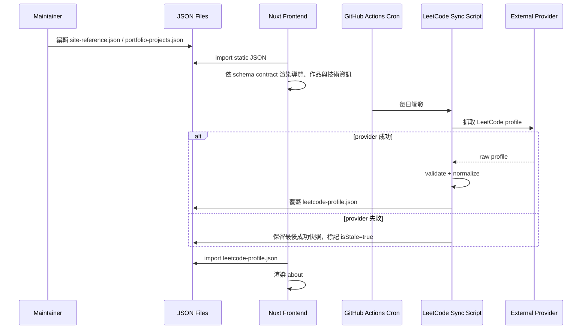

# JSON File SSOT SA v1

## 1. 商業目標

- 建立 JSON File SSOT，讓重構後資料仍可追蹤、驗證與排程更新。
- 保留既有作品集、導航、anchors、技術分類、icon token、LeetCode normalized ViewModel。
- 將第三方 provider 原始資料隔離在同步流程內，前端只讀固定 JSON contract。

## 2. 模組邊界

- 本規格只定義 JSON 檔案格式、資料流、排程規則與責任分工。
- 本規格不實作 Vue component、不實作資料抓取程式、不撰寫 GitHub Actions workflow。
- 機器可驗證格式以 `/schemas/*.schema.json` 為準。
- Supervisor Agent 01 必須搭配 Watcher Agent 90 監控交接、產出與 CI/CD 門禁，避免 JSON、Schema、TypeScript types、workflow 與前端消費欄位漂移。

## 3. JSON 檔案配置

```text
assets/data/site-reference.json
assets/data/portfolio-projects.json
assets/data/leetcode-profile.json
schemas/site-reference.schema.json
schemas/portfolio-projects.schema.json
schemas/leetcode-profile.schema.json
```

## 4. 資料流



## 5. 檔案契約

### 5.1 `site-reference.json`

- 承載：navigation menus、page anchors、technology catalogs、icon registry。
- Schema：`schemas/site-reference.schema.json`
- 更新方式：人工維護。
- 排程：不需要。

### 5.2 `portfolio-projects.json`

- 承載：作品集 metadata。
- Schema：`schemas/portfolio-projects.schema.json`
- 更新方式：人工維護。
- 排程：不需要。
- 必須保留 `id` 與 `i18nNamespace`，以對應 `portfolio.projects.<id>` 翻譯命名空間。

### 5.3 `leetcode-profile.json`

- 承載：LeetCode normalized read model。
- Schema：`schemas/leetcode-profile.schema.json`
- 更新方式：排程產生。
- 排程：每日一次，由 `.github/workflows/sync-leetcode.yml` 的 GitHub Actions `schedule` 觸發。
- 失敗策略：保留最後成功快照，將 `isStale` 標記為 `true`，不得輸出第三方錯誤 payload 給前端。

## 6. DTO 契約

```ts
type ApiEnvelope<T> = {
  statusCode: number
  message: string
  data: T
}

type StaticJsonSource<T> = T
```

本階段前端可直接 import JSON，不強制包成 API response。
若未來建立 server API，回應必須包裝為 `{ statusCode, message, data }`。

## 7. 安全與驗證

- 所有外部連結必須為 `https://`。
- `username` 必須符合 `^[A-Za-z0-9_-]{1,32}$`。
- JSON schema 驗證必須作為 CI 檢查項目。
- LeetCode provider 原始 response 不得 commit 到 repo。
- 排程若需要 token，必須使用 GitHub Actions secrets，不得寫入 JSON 或 source code。
- workflow 必須先同步 LeetCode snapshot，再執行 JSON SSOT 驗證，最後才允許 generate/deploy。

## 8. 架構風險提示

- JSON File SSOT 適合個人作品集與低頻內容更新；不適合多人高頻後台編輯。
- `leetcode-profile.json` 是快照，不是即時資料；畫面應避免宣稱即時。
- 若未來作品集需要 CMS、審核流或多人編輯，應升版改為資料庫或 headless CMS。
