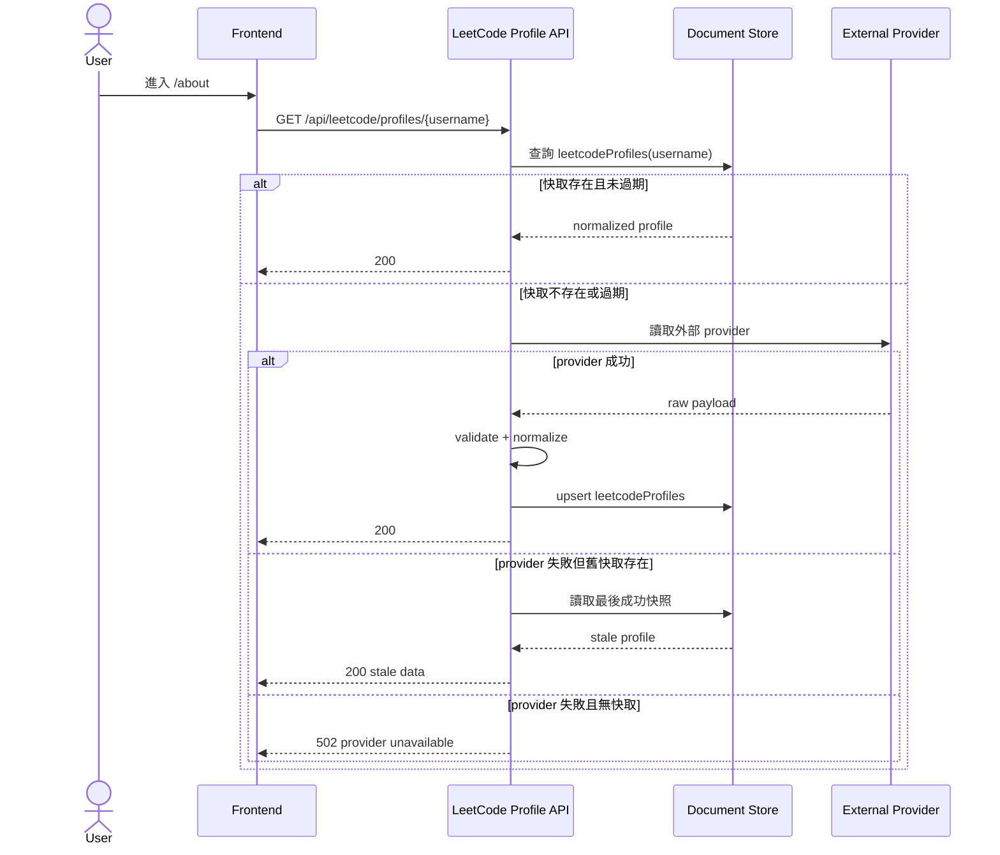

# LeetCode Profile SA v1

## 1. 商業目標
- 將 about 頁 LeetCode 區塊可保留的資料契約正式化。
- 凍結目前已正規化完成的 ViewModel，而不是綁定第三方 provider 原始格式。
- 允許外部 provider 更換，但前端讀到的 `LeetCodeStats` 形狀保持穩定。
- 將 mock、快取、外部抓取失敗回退納入正式流程。

## 2. 模組邊界
- 本模組對外提供前端可直接渲染的正規化資料。
- 本模組不對外暴露第三方 provider 原始 response。
- 本模組不承載 about 頁其他內容。

## 3. 流程圖


## 4. API 路由

### 4.1 `GET /api/leetcode/profiles/{username}`
- 用途：取得指定使用者的正規化 LeetCode 資料。
- 回應格式：`{ statusCode, message, data: LeetCodeProfileDto }`

### 4.2 `POST /api/leetcode/profiles/refresh`
- 用途：強制刷新指定使用者資料，供排程或後台使用。
- Request：`{ username: string }`
- 回應格式：`{ statusCode, message, data: LeetCodeProfileDto }`

```ts
type LeetCodeRecentDto = {
  title: string
  titleSlug: string
  time: string
  status: string
  lang: string
  isSuccess: boolean
}

type LeetCodeSkillDto = {
  name: string
  value: number
}

type LeetCodeProfileDto = {
  username: string
  totalSolved: number
  totalQuestions: number
  easy: number
  medium: number
  hard: number
  easyPct: number
  mediumPct: number
  hardPct: number
  calendar: [string, number][]
  recent: LeetCodeRecentDto[]
  skills: LeetCodeSkillDto[]
  source: string
  sourceFetchedAt: string
}
```

## 5. 驗證與安全
- `username` 建議 regex：`^[A-Za-z0-9_-]{1,32}$`
- `POST /refresh` 必須加入服務端權限控管或內網保護
- 外部 provider response 必須先驗證，再寫入 normalized document
- provider 失敗不可直接把錯誤 payload 透傳到前端

## 6. 架構風險提示
- 現況同時存在 mock shape、第三方 response shape、normalized ViewModel；v1 正式凍結的只有 normalized ViewModel。
- `calendar` 使用 tuple 陣列是為了保留現況契約；若未來改成 object array，必須升版。
- `time` 為 UI-ready 字串，不是原始 timestamp；若改回原始值，也必須升版。
