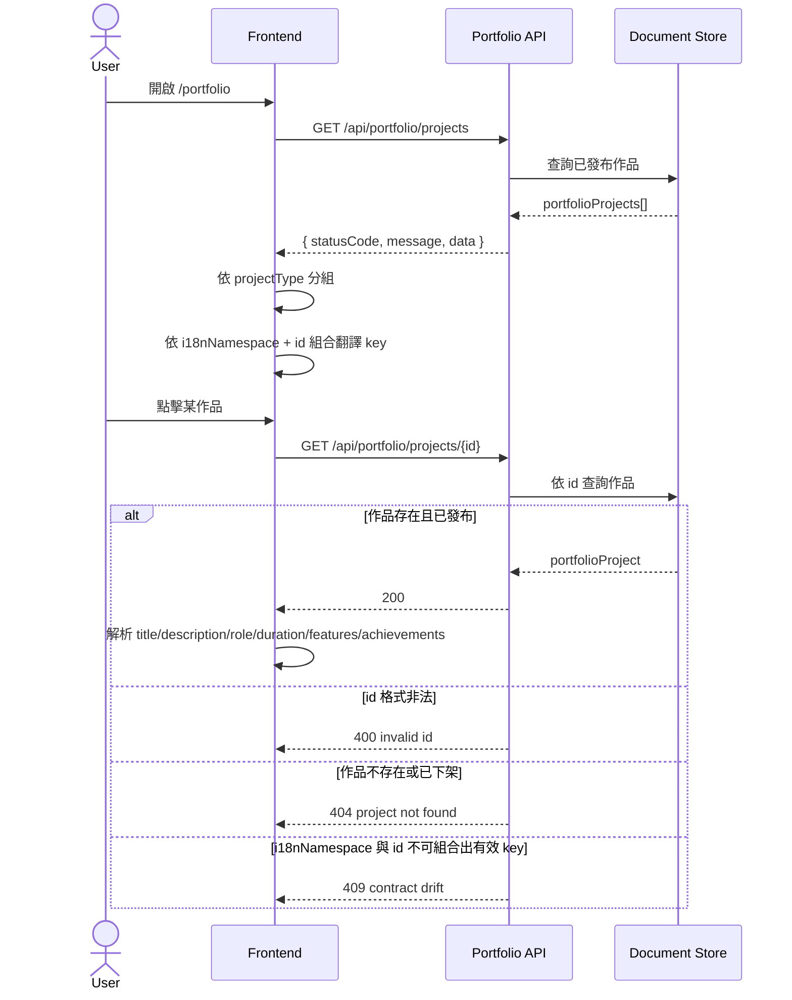

# Portfolio Showcase SA v1

## 1. 商業目標
- 將作品集列表與詳情頁使用的核心資料正式化。
- 凍結作品主鍵 `id`，避免重構時破壞路由、翻譯與 detail lookup。
- 凍結 `i18nNamespace` 契約，保留目前 `portfolio.projects.<id>` 的文案解析方式。
- 讓 UI 重構可以替換卡片、詳情版面與動畫，但不破壞資料語意。

## 2. 模組邊界
- 本模組只管理作品集 metadata 與 detail lookup 所需資料。
- 本模組不直接存放翻譯文案內容，只提供翻譯命名空間與穩定主鍵。
- 本模組不處理站點導航與 LeetCode 成績。

## 3. 流程圖


## 4. API 路由

### 4.1 `GET /api/portfolio/projects`
- 用途：取得作品列表。
- 回應格式：`{ statusCode, message, data: PortfolioProjectDto[] }`

### 4.2 `GET /api/portfolio/projects/{id}`
- 用途：取得指定作品的 metadata。
- 回應格式：`{ statusCode, message, data: PortfolioProjectDto }`

```ts
type PortfolioTechnologyDto = {
  name: string
  icon: string
  category?: string | null
}

type PortfolioScreenshotDto = {
  url: string
  caption?: string | null
}

type PortfolioProjectDto = {
  id: string
  projectType: 'company' | 'personal'
  i18nNamespace: string
  link: string | null
  technologies: PortfolioTechnologyDto[]
  screenshots: PortfolioScreenshotDto[]
  displayOrder: number
  isPublished: boolean
}
```

## 5. 契約規則
- `id` 為唯一 lookup key，禁止改名。
- `i18nNamespace` 在 v1 固定為 `portfolio.projects`。
- 前端文案解析規則：
  - `title` => `${i18nNamespace}.${id}.title`
  - `role` => `${i18nNamespace}.${id}.role`
  - `duration` => `${i18nNamespace}.${id}.duration`
  - `description` => `${i18nNamespace}.${id}.description`
  - `features` => `${i18nNamespace}.${id}.features`
  - `achievements` => `${i18nNamespace}.${id}.achievements`

## 6. 驗證與安全
- `id` 僅允許小寫英文、數字與 `-`，建議 regex：`^[a-z0-9-]+$`
- `link` 若存在，僅允許 `https://` 外部連結
- `screenshots[].url` 必須為受控靜態資產或白名單 CDN
- `projectType` 僅允許 `company | personal`

## 7. 架構風險提示
- 若未來把實際文案搬進後端或 CMS，`i18nNamespace` 契約需升版，不能靜默改動。
- 若 `technologies.icon` 與 icon registry 脫鉤，作品卡片與詳情頁會同時壞掉。
- 現況以 `id` 推導公司專案/個人專案的做法不可保留；正式契約應以 `projectType` 為準。
