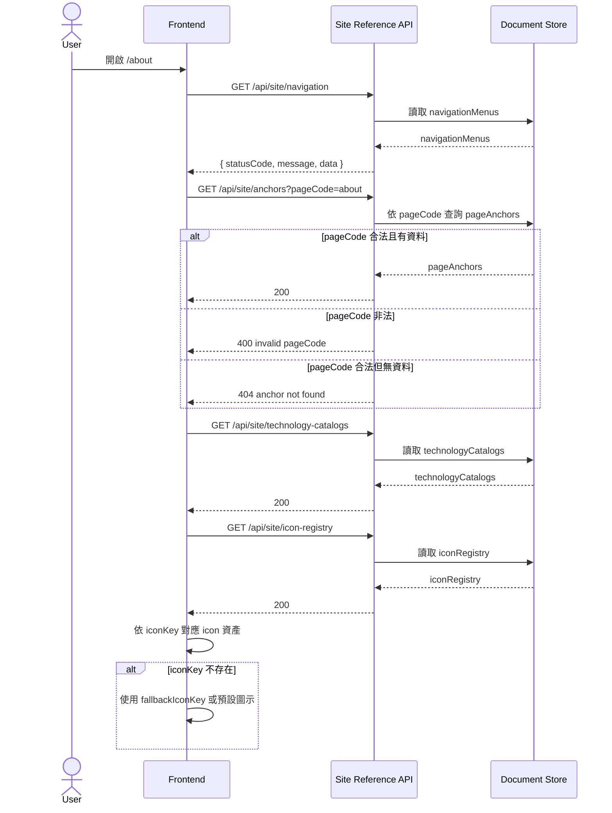

# Site Reference Data SA v1

## 1. 商業目標
- 將站點共用參考資料正式化，保留重構後仍不可破壞的資訊架構。
- 凍結首頁、關於、作品集三個主路由的導航契約。
- 凍結 about/portfolio 所需的 anchors、技術分類與 icon registry 契約。
- 讓前端在重構 UI 時，可以替換組件與版型，但不破壞資料來源格式。

## 2. 模組邊界
- 本模組只處理站點共用 reference data。
- 本模組不承載作品詳情文案，不承載 LeetCode 成績資料。
- 本模組不直接輸出 Vue component，不綁定任何 UI library。

## 3. 流程圖


## 4. API 路由

### 4.1 `GET /api/site/navigation`
- 用途：取得站點主導航。
- 回應格式：`{ statusCode, message, data: NavigationMenuDto[] }`

```ts
type NavigationMenuDto = {
  id: string
  routePath: string
  label: string
  displayOrder: number
  isVisible: boolean
}
```

### 4.2 `GET /api/site/anchors?pageCode={pageCode}`
- 用途：取得指定頁面的 anchor 導覽資料。
- `pageCode` 允許值：`home | about | portfolio`
- 回應格式：`{ statusCode, message, data: PageAnchorDto[] }`

```ts
type PageAnchorDto = {
  id: string
  pageCode: string
  key: string
  href: string
  title: string
  displayOrder: number
}
```

### 4.3 `GET /api/site/technology-catalogs`
- 用途：取得關於頁技術分類資料。
- 回應格式：`{ statusCode, message, data: TechnologyCatalogDto[] }`

```ts
type TechnologyCatalogItemDto = {
  name: string
  iconName: string
  color: string | null
}

type TechnologyCatalogDto = {
  id: string
  titleKey: string
  descriptionKey: string
  items: TechnologyCatalogItemDto[]
}
```

### 4.4 `GET /api/site/icon-registry`
- 用途：取得可用 icon token 與資產映射。
- 回應格式：`{ statusCode, message, data: IconRegistryDto[] }`

```ts
type IconRegistryDto = {
  id: string
  iconKey: string
  assetPath: string
  componentName: string
  fallbackIconKey: string | null
  isAvailable: boolean
}
```

## 5. 驗證與安全
- `pageCode` 必須為白名單值；不得接受任意字串查詢。
- `routePath` 僅允許站內路由，禁止注入外部網址。
- `assetPath` 僅允許站內靜態資產路徑或受控 CDN 白名單。
- `iconKey` 必須在 registry 中唯一；禁止前端自由拼字命中未登錄資源。

## 6. 架構風險提示
- `label` 與 `title` 目前為字面值，不是 i18n key；若未來要多語管理，需升版處理。
- `iconName` 與 `iconKey` 若分裂為兩套命名，會造成畫面 fallback 不可預測。
- 若 about 技術分類新增排序與分組規則，應在本模組擴欄，而非把排序邏輯回推到 UI。
