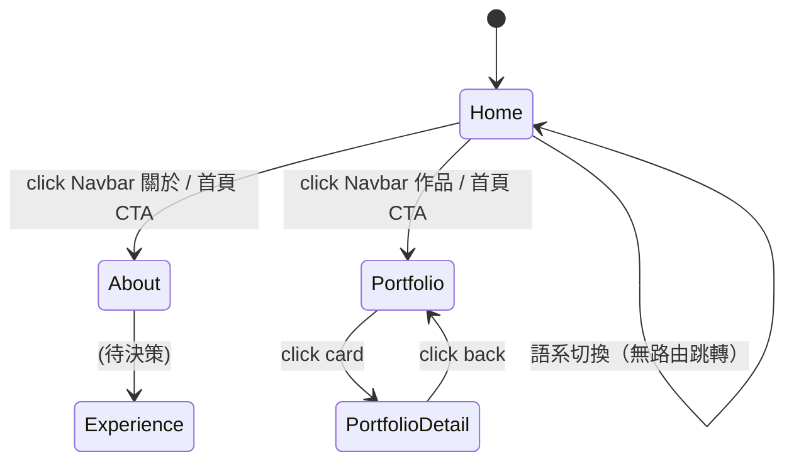

# 📐 Site Global UI Spec v1.0

> 產出：03 UI Agent / 督導：01 PM + 02 Tech Lead
> 日期：2026-04-19
> 適用範圍：Charlie Portfolio Frontend 全站

## 1. 商業背景（Business Context）
個人作品集 + 作品展示 + LeetCode 追蹤。受眾為技術主管、HR、合作開發者。需兼顧「技術專業感」與「個人品牌溫度」。

---

## 2. 全域 Design Tokens（Assets & Tokens）

### 2.1 色彩系統（對齊 `tailwind.config.js`）
| Token | Light | Dark | 用途 |
|---|---|---|---|
| `primary` | `#FF6B35` | `#FF8C42` | CTA、高亮、品牌識別 |
| `secondary` | `#FF8C42` | `#FFB080` | 次要強調 |
| `accent` | `#F43F5E`（rose-500） | `#FB7185` | Gradient 搭配、重點動效 |
| `surface` | `#FCF7F1` (bg-background) | `#0F172A` (slate-950) | 頁面底色 |
| `surface-2` | `#FFFFFF` | `#1E293B` (slate-800) | 卡片、浮層 |
| `border` | `slate-200` | `slate-700` | 分隔線、邊框 |
| `text-strong` | `slate-900` | `white` | H1、重點文字 |
| `text-body` | `slate-600` | `slate-300` | 內文 |
| `text-muted` | `slate-400` | `slate-500` | 提示、副標 |

⚠️ **禁令**：未定義於此表之色碼（如 `#3B82F6`、`#6B7280`）**不得出現於元件**。

### 2.2 字體系統
| 用途 | Family | 使用 class |
|---|---|---|
| Display（H1/H2）| Sora | `font-display` |
| Body | Tailwind 預設 system-sans | 預設 |
| Code / Mono | JetBrains Mono | `font-mono` |

### 2.3 Icon 策略
- 已載入 `@ant-design-vue/nuxt`：**優先使用 AntDV icon**（`@ant-design/icons-vue`）
- 禁止重複引入 Lucide / Heroicons（避免 bundle 膨脹）

### 2.4 間距與圓角
- 圓角 scale：`rounded-full | rounded-2xl (主要卡片) | rounded-xl (次要) | rounded-lg (小元件)`
- 標準內距：`px-5 sm:px-8 lg:px-10`（對齊 home 頁改版值）

---

## 3. 元件狀態規範（Components & States）

### 3.1 `CButton`（需改造）
**現況問題**：硬編碼 `#FF6B35`、`#FF8C42`，未 dark mode。

**新規範**：
| 變體 | Light | Dark | Hover |
|---|---|---|---|
| `primary`（主按鈕） | `bg-gradient-to-r from-primary to-accent text-white shadow-lg shadow-primary/30` | 同 + `shadow-primary/40` | `-translate-y-0.5 shadow-xl` |
| `secondary`（次按鈕） | `border border-slate-300 text-slate-600` | `border-slate-600 text-slate-200` | `bg-white dark:bg-slate-800 text-primary` |
| `ghost`（無框） | `text-slate-600` | `text-slate-300` | `bg-slate-100 dark:bg-slate-800` |

狀態必備：`default / hover / focus-visible (ring-2 ring-primary/50) / disabled (opacity-50 cursor-not-allowed)`

### 3.2 `BackgroundDecor`（**新元件 · 共用**）
取代 `index.vue`、`about/index.vue`、`portfolio/index.vue`、`portfolio/detail/index.vue` 中重複的背景裝飾。

**Props**：
- `variant: 'home' | 'subpage'` — home 版有較多 blobs + 較強色彩；subpage 版簡化（只 2 顆 blob）
- `density: 'normal' | 'subtle'` — 控制 dot grid 不透明度

**內容結構**：3 顆 `blur-3xl` blob + dot grid + dark mode 對應色

### 3.3 `CAnchor`（**重構**）
**現況問題**：手機遮擋、桌機佔空間太大。

**新三段式斷點規範**：
| 斷點 | 顯示策略 | 樣式 |
|---|---|---|
| `< md` (< 768px) | **完全隱藏** (`hidden`) | — |
| `md ~ xl` (768 ~ 1280px) | **Dot-only 模式**：只顯示小圓點直條，懸停時 tooltip 顯示標題 | `md:flex flex-col gap-4 bg-transparent` |
| `≥ xl` (≥ 1280px) | **完整模式**：Dot + 文字（現行樣式改良） | `xl:bg-white/80 xl:p-4 xl:rounded-2xl` |

- active dot：`bg-primary scale-125`
- inactive dot：`bg-slate-300 dark:bg-slate-600`
- tooltip：使用原生 CSS `::before` pseudo-element 或 AntDV `Tooltip`
- dark mode 必配：背景 `dark:bg-slate-900/80`、邊框 `dark:border-white/10`

### 3.4 `BaseNavbar`（**重構**）
**現況問題**：完全無 RWD，手機會擠壓。

**新規範**：
| 斷點 | 佈局 |
|---|---|
| `≥ md` | 橫向排列（現行樣式保留），dark mode 補色 |
| `< md` | Logo 左 + Hamburger 右；點擊 Hamburger → 全屏 overlay 選單（slide-in from right） |

- Hamburger icon：AntDV `MenuOutlined` / `CloseOutlined`
- Overlay：`fixed inset-0 bg-surface/95 backdrop-blur-xl z-50`，menu items 垂直堆疊、大字體
- 動畫：`translate-x-full → translate-x-0`，300ms

### 3.5 `BaseFooter`（**建置**）
**現況**：完全空白。

**新規範**（簡版）：
```
┌─────────────────────────────────────────┐
│  [Logo]                  [社交連結]     │
│  [短描述/標語]                          │
│  ─────────────────────────────────      │
│  © 2026 Charlie Tai · Built with Nuxt   │
└─────────────────────────────────────────┘
```
- 高度：`py-8 md:py-10`
- 文字：`text-sm text-muted`
- 社交連結：GitHub / LinkedIn / Email（AntDV icons）

### 3.6 `LanguageSwitch`（**微調**）
現行樣式 OK，僅補 dark mode：
- `bg-slate-100/80 dark:bg-slate-800/80`
- `text-slate-400 dark:text-slate-400`
- active: `bg-white dark:bg-slate-900 text-primary`

---

## 4. 非同步與狀態回饋（Async States）

### 4.1 列表載入（portfolio）
- **Loading**：Skeleton 卡片陣列（3–6 張）
- **Empty**：現有 📂 + 文案保留，顏色改用 token `text-muted`
- **Error**：Toast + Retry 按鈕（若專案仍走純靜態則可略）

### 4.2 圖片失敗回退
- Portfolio card 圖片：`@error` 改為漸層 placeholder（`bg-gradient-to-br from-primary/20 to-accent/20`）

---

## 5. 版面佈局與 RWD（Layout & RWD）

### 5.1 全域斷點標準
| 名稱 | Tailwind | 寬度 | 主要使用場景 |
|---|---|---|---|
| Mobile | default | < 640px | 單欄、文字置中 |
| SM | `sm:` | ≥ 640px | 大手機、平板直 |
| MD | `md:` | ≥ 768px | 平板、小桌機 |
| LG | `lg:` | ≥ 1024px | 標準桌機 |
| XL | `xl:` | ≥ 1280px | 大桌機、CAnchor 展開 |
| 2XL | `2xl:` | ≥ 1536px | 寬螢幕 |

### 5.2 Layout 共用規範
- `default.vue`：移除 `px-[30px] py-[10px]` 的硬寫，改 `px-5 md:px-8 lg:px-10 py-3 md:py-4`
- 手機 Navbar 高度：48px；桌機：64px
- 內容區預留 Navbar 高度：`pt-14 md:pt-16`

---

## 6. 畫面流轉（Screen Flows）



---

## 7. 視圖元件映射表（View Mapping）

| 路由 | Layout | Background variant | CAnchor | 獨特元件 |
|---|---|---|---|---|
| `/` | default | home | ✅ anchorHomePage | HomeTerminal |
| `/about` | default | subpage | ✅ anchorAboutPage | AboutSection, ExperienceSection, TechnologyStackSection, LeetcodeSection |
| `/experience` | **TBD** | — | ❌ | ⚠️ 待決策（目前為測試圖） |
| `/portfolio` | default | subpage | ✅ anchorPortfolioPage | PortfolioCard grid |
| `/portfolio/detail` | default | subpage | ❌（單頁不需錨點）| Hero + Content sections |

---

## 8. 交付標準檢查表
- [x] Design Tokens 定義 light + dark
- [x] CAnchor 三段斷點
- [x] Navbar hamburger 流程
- [x] 共用背景元件抽象
- [x] 視圖元件對齊路由

---

## 9. 遺留議題（交還 PM 決策）
1. `pages/experience/index.vue` — **刪除 / 重做 / 合併進 About**（建議合併，已在 `/about` 有 ExperienceSection）
2. 是否導入 shadcn-vue？→ 見 04 Frontend 評估報告
